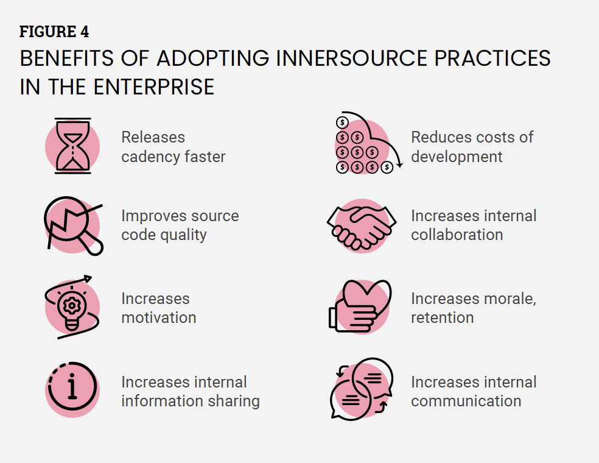

Implement inner sourcing practices
===========

落地内源实践
============

Inner sourcing is the application of open source methodologies
to development projects inside the organization. The goal is to
incubate the same capabilities within the enterprise as those
in the open source community and to foster new employee-toemployee
relationships that are cross-functional and touch on
multiple product domains.

内源是开源方法论在组织内部开发项目的实际应用。其目的是在企业内部孵化出与开源社区一样的能力，以此来促进跨职能并且涉及多产品领域之间员工与员工之间的关系。

**FIGURE 4**

**图4**

BENEFITS OF ADOPTING INNERSOURCE PRACTICES IN THE ENTERPRISE
在企业采用内部开源实践的好处

Releases cadency faster
Improves source code quality
Increases motivation
Increases internal information sharing

更快的发布周期
提高源代码质量
增加动力
增加内部信息共享

Reduces costs of development
Increases internal collaboration
Increases morale, retention
Increases internal communication

降低开发成本
增加内部协作
提高士气，提高员工保留率
增加内部沟通

Open source principles work well on large-scale projects
distributed across an enterprise. Many Fortune 500 organizations
have adopted them externally and internally for the same
reasons: faster releases, improved quality, increased innovation
and communications, information sharing, reduced costs, greater
and more effective collaboration, and increased employee morale
and retention.

开源原则适用于企业内部大规模分布式项目的研发。很多财富 500 强企业在内外部采用开源都是基于同一个原因：加快发布、提高质量、增强创新与交流、信息共享、降低成本、更好及更有效地协作以及提高员工士气和留存率。

Inner sourcing prepares organizations to work effectively with
external open source communities. It encourages employees to
interact with colleagues elsewhere and with external community
members without switching contexts. In addition, new employees
familiar with this development model may integrate more
quickly into established workflows. Finally, business partners are
probably already using many of these development practices, so
when an organization adopts inner sourcing practices, it is also
strengthening its integration with the commercial ecosystem.

内源能够让企业在和外部开源社区进行有效工作上做好准备。它鼓励员工和其他地方的同事以及外部社区成员在无需切换上下文的情况下就能够进行互动。除此之外，熟悉这种研发模式的新员工可以更快速的融入到已经建立起来的工作流中。最终，那些或许已经在使用这些众多研发实践的业务伙伴，在遇到企业在采用内源实践时，是能够加强它们与商业生态之间的整合的。
