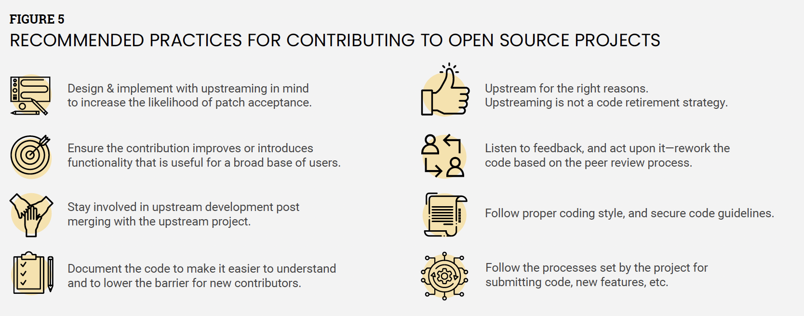

Recommendations and lessons learned
===================================

推荐和经验教训
===================================

保持耐心

### Be patient

### 保持耐心

It takes considerable time to grow internal open source expertise. The
goal from an enterprise perspective is to find people with enough peer
recognition to be influential in the community. There are typically
three pillars to this: domain expertise, open source methodology, and
working practices.

培养内部开源专业知识需要相当长的时间。从企业的角度来看，目标是找到在社区中具有足够同行认可的人，能够在其中产生影响力。通常有三个支柱：领域专业知识、开源方法论和工作实践。

### Shift to a more collaborative environment

Internal organization dynamics must be favorable to open source
efforts. Implementing these practices requires a shift from
traditional software development practices to a more open and
collaborative mindset. As an open source leader inside

your organization, you will face several challenges in funding
resources, justifying ROI, getting upstream focus, etc. These often
require a major shift in mindset and a lot of education up the command
chain.

### 转向更协作的环境

内部组织动态必须对开源努力持有积极态度。实施这些实践需要从传统的软件开发实践转向更加开放和协作的思维方式。作为组织内的开源领导者，您将面临一些挑战，如寻找资源、证明投资回报率、获得上游关注等。这通常需要在思维方式上进行重大转变，并在指挥链上进行大量教育。

### Embrace a flexible IT infrastructure

These open source practices require an IT infrastructure free from
many limiting IT policies and a computing environment that supports
open source development.

### 拥抱灵活的IT基础设施

这些开源实践要求有一个摆脱许多限制性IT政策的IT基础设施，以及支持开源开发的计算环境。

### Adopt proper success metrics

Proper open source metrics drive the desired development behavior.
Unfortunately, the traditional metrics often used in product
organizations only apply in the context of open source development.
For example, we have had multiple instances of the upstream
implementation of desired functionality because of OSG developers that
lobby for support from the community.

In this case, the number of changesets or lines of code does not
matter as much, as the technical leadership team members provide to
get code upstream and reduce our downstream maintenance efforts. The
metrics we track account for things like this.

### 采用适当的成功度量标准

适当的开源度量标准推动期望的开发行为。不幸的是，在产品组织中通常使用的传统度量标准只适用于开源开发的上下文。例如，由于OSG开发人员游说社区支持，我们曾多次看到期望功能的上游实现。

在这种情况下，变更集或代码行数并不那么重要，因为技术领导团队成员提供的是将代码上游并减少我们的下游维护工作。我们跟踪的度量标准涵盖了这些方面。

### Use a lightweight approval process

Organizations have transitioned from highly complex and cumbersome
policies to a more straightforward approach for receiving, reviewing,
and approving source code contributions. Dedicated open source teams
often receive blanket approval to contribute to open source projects.
This is not the case for other groups, which need different approval
levels depending on the nature of the contributed code (e.g., simple
bug fixes, code to improve existing functionality, code that offers
new functionality, or starting a new project). This is a function of
the balance between all parties involved: legal, engineering, and open
source.

### 使用轻量级的批准流程

组织已经从高度复杂和繁琐的政策过渡到了对源代码贡献的更为简单的方法，包括接收、审查和批准。专门的开源团队通常获得全面批准，可以为开源项目做出贡献。对其他团队来说，情况并非如此，它们需要根据贡献代码的性质（例如，简单的错误修复、改进现有功能的代码、提供新功能的代码或启动新项目的代码）获得不同的批准级别。这取决于所有涉及方之间的平衡：法务、工程和开源。

### Share information

The organization must share information and priorities across
different divisions. To illustrate this, assume you are on an open
source team and request to support the implementation of a driver, but
you cannot access the hardware manual and
instructions. This situation sounds a bit like playing darts with the
lights off; therefore, information sharing is critical to successful
internal collaborations between the open source teams and everyone
else.

### 共享信息

组织必须在不同部门之间分享信息和优先事项。为了说明这一点，假设您在一个开源团队中，并请求支持驱动程序的实现，但您无法访问硬件手册和说明。这种情况听起来有点像在灯光熄灭的情况下玩飞镖；因此，信息共享对于开源团队与其他人之间成功的内部协作至关重要。

### Make strategic contributions

Focus your contributions on upstream projects that would directly
benefit the organization's strategy and products. In open source
development, it is easy to get carried away by hopping between
different exciting projects. However, in an enterprise setting where
the open source group is a cost center, your driving force should be
to focus on open source projects that support product development.
Open source teams often perform a yearly review of the product
portfolio they support and focus their involvement on open source
projects commonly used across as many products as possible. Such a
methodology drives priorities and is a great way to remain focused on
what's essential, justifiable, and fundable.

### 进行战略性贡献

将您的贡献重点放在能够直接有利于组织战略和产品的上游项目上。在开源开发中，很容易被在不同激动人心的项目之间跳动所迷惑。然而，在一个企业环境中，开源团队是一个成本中心，您的驱动力应该是专注于支持产品开发的开源项目。开源团队通常会对其支持的产品组合进行年度审查，并将他们的参与重点放在尽可能多的产品中普遍使用的开源项目上。这种方法推动了优先事项，并是保持专注于重要、可证明和可资助的事物的一种有效方法。

###  Partner with product teams

Be the upstream partner for product teams; they often feel like they
are working inside a pressure cooker, especially in a consumer
electronics environment. They often seem

understaffed, need more critical resources to support parallel
upstream development, and are under constant pressure for feature
delivery within tight schedules. In such an environment, it is easy to
overlook the benefit of upstreaming in favor of short-term time
savings, which can, unfortunately, lead to technical debt that has a
higher cost in the long term.

Open source teams can help by being a partner that focuses on
delivering the necessary code upstream, reducing this technical debt.

### 与产品团队合作

成为产品团队的上游合作伙伴；他们经常感觉自己好像在压力锅中工作，尤其是在消费电子环境中。他们常常显得人手不足，需要更多的关键资源来支持并行上游开发，并在紧张的时间表内交付功能。在这种环境中，很容易忽视上游化的好处，以换取短期的时间节省，这很不幸可能导致长期更高成本的技术债务。

开源团队可以通过成为专注于将必要的代码上游提交的伙伴来提供帮助，从而减少这种技术债务。

**FIGURE 5**

**图5**

RECOMMENDED PRACTICES FOR CONTRIBUTING TO OPEN SOURCE PROJECTS
--------------------------------------------------------------

Design & implement with upstreaming in mind to increase the likelihood
of patch acceptance.

Ensure the contribution improves or introduces functionality that is
useful for a broad base of users.

Stay involved in upstream development post merging with the upstream
project.

Document the code to make it easier to understand and to lower the
barrier for new contributors.

Upstream for the right reasons.

Upstreaming is not a code retirement strategy.

Listen to feedback, and act upon it---rework the code based on the
peer review process.

Follow proper coding style, and secure code guidelines.

Follow the processes set by the project for submitting code, new
features, etc.

### 贡献给开源项目的推荐实践

设计并实现时考虑上游，以增加补丁被接受的可能性。

确保贡献改进或引入对广泛用户群有用的功能。

在与上游项目合并后，保持参与上游开发。

文档化代码以使其更容易理解，并降低新贡献者的门槛。

以正确的原因上游。

上游化不是一种代码退休策略。

倾听反馈，并根据同行评审过程重塑代码。

遵循适当的编码风格和安全代码指南。

遵循项目为提交代码、新功能等制定的流程。

### Grow open source talent

Grow open source talent in specific technology areas relevant to your
products. Hiring a few resources from outside the organization is
easy, but this approach has several limitations. The alternative
approach is to convert your existing developers into open source
contributors via training on the technical domain and open source
methodology. You can then pair these developers with a mentor to
further expand their skills.

Encourage developers outside the open source team to learn from and
contribute to the open source community. We provide as much help as we
can with upstream code contributions.

Still, we need more resources and sometimes need a deeper
understanding of products that might be necessary to identify where we
can adequately upstream code. Better involvement in the open source
community from teams outside our own allows us to get more critical
code upstream and improves our ability to interact with the community.

### 发展开源人才

在与产品相关的特定技术领域培养开源人才。从组织外部聘请一些资源很容易，但这种方法有一些限制。替代方法是通过在技术领域和开源方法论培训现有开发人员，将其转变为开源贡献者。然后，您可以将这些开发人员与导师配对，以进一步扩展他们的技能。

鼓励开源团队之外的开发人员向开源社区学习并做出贡献。我们尽力提供上游代码贡献方面的帮助。

但是，我们需要更多的资源，有时需要更深入地了解可能对识别我们可以充分上游代码的地方至关重要的产品。来自我们自己团队之外的对开源社区的更好参与允许我们更多地将关键代码上游，并提高我们与社区互动的能力。
