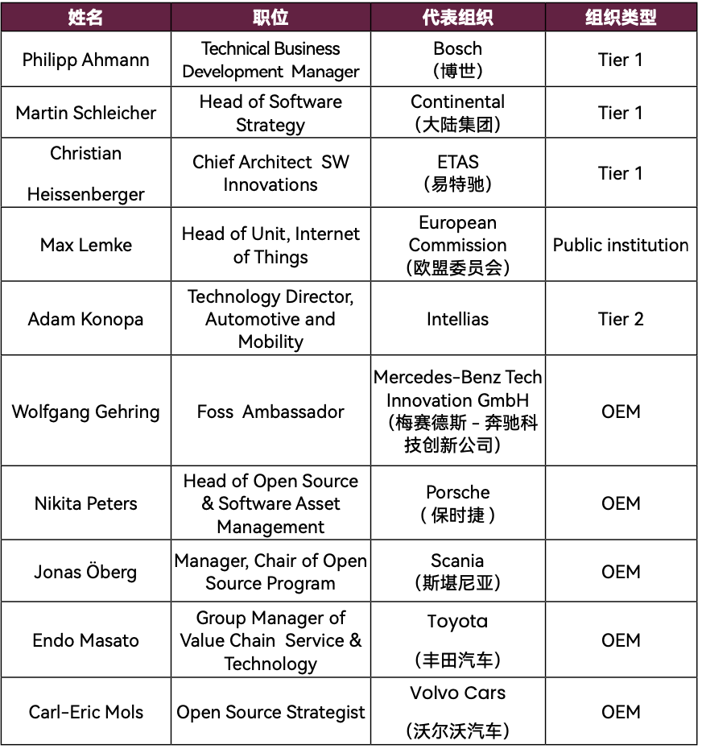

内容摘要
随着汽车行业从主要以硬件为中心向以软件为中心过渡，汽车行业面临着各种挑战和机遇。在这个过渡的过程中，值得整个行业去思考如何应对。本文探讨了开源软件OSS在该行业的现状和未来趋势。我们得出以下结论：

采用开源软件的必要性： 汽车行业采用开源软件不仅是一种趋势，更是一种必然。在任何地区，汽车行业的竞争力都取决于对开源软件的使用情况，包括利用开源软件的能力和分享先进技术的意愿。这不仅对技术进步至关重要，而且对克服商业战略封锁的复杂性和确保欧洲重要行业的数字主权也至关重要。

在向软件为中心转型中的能力建设：在电气化、自动驾驶和其他技术进步的推动下，汽车行业的转型标志着从硬件到软件的明显过渡。这些变革 带来机遇的同时，也带来了巨大的挑战，单个实体无法单独应对。该行业历来以硬件为中心，这有时会成为迎接这些变革的障碍。这些转变的障碍。要应对这些挑战，就必须在开源软件的能力建设方面进行投入。。开源项目办公室（OSPO）等举措有助于促进对开源软件的理解，从战略上应用开源以及在组织内培养开源文化。这些架构上的变化会让汽车行业对下一代的软件人才更具吸引力。

传统模式的挑战：传统汽车行业中供应商层级结构往往与开源软件的协作精神相冲突。从传统模式转变为以开源模式为运行规则的生态系统对产业至关重要。此外，政府通过提供政策便利和财政支持是促进这种转变的催化剂。这种支持为重新定位竞合关系铺平了道路。

重新思考合作与竞争： 与软件发挥基础性作用的传统信息产业不同，汽车企业往往倾向于进行内部软件开发，但这限制了其竞争优势。区分差异化技术和通用技术至关重要，这促使汽车行业产业链参与方需要重新评估其在合作与竞争方面的定位。尤其是围绕软件供应链可持续性的合作，已成为一条明确的前进道路。

数字主权与开放平台： 本文所访谈的专家们一致表示，需要在OSS（Open Source Software）开源软件和开放标准的基础上构建未来的SDV（Software-Defined Vehicle）软件定义汽车平台。在这个日益区域化的世界中，“数字主权“，也就是独立决策并与区域目标保持一致的能力变得更加重要。但开源模式和这一目标并不冲突，而且还有助于通过开源协作实现总体目标来提高行业的全球竞争力。

摘要 											              
导言 											              
研究设计 										              
1.开源软件的使用和再利用现状与趋势					          
开源软件已成为公司战略的一部分 						        
开源软件在车外的使用率高于车内的使用率				        
车载计算架构的集中化 								        
建立一个通用但可解耦的 SDV 平台 						    
标准化SDV平台开发在进行，但进展缓慢 				        
新技术在推动这种转型 								        

2.将开源软件在汽车行业的应用上升到战略层面				    
从以硬件为中心过渡到以软件为中心 					        
文化、安全法规、传统技术和车辆寿命延缓了转型 			    
实现变革所需的知识和能力 							        
市场存量人才和吸引技专业人才的挑战						    
开源办公室（OSPOs）: 企业内支持和推进开源软和开源文化的所在   

3. 在汽车行业培育开源生态 							        
层级式供应商结构无法兼容互相依赖的系统生态		             
通过积极的合作, 走向生态系统结构 							    
政府的推动和资助是变革的驱动力						        
OEM厂商和 Tier 1之间的“你来我往”								
寻求战略合作伙伴是补充内部能力的手段之一                      

4. 竞争中的合作 								
商业技术的认定和合作 								

5. 汽车开源软件的安全与保障						
汽车功能安全认证和开源软件开发 						
确保开源软件供应链的健康和可持续发展					

6. 维护数字主权的同时进一步提升竞争力						
在逆全球化的世界中建立开放式 SDV 平台的必要性 			
通过组织内能力和协作突破封锁 						

建议 											
汽车行业决策者 									
欧盟和国家政策制定者 							

导言
				2023年11月1日撰写于布鲁塞尔、斯德哥尔摩

汽车行业具有悠久的历史，这种历史积淀是在技术进步和行业变革的持续推动下不断发展的。如今，电动汽车、自动驾驶、互联互通和服务化这四大颠覆性变革正引领汽车行业的发展。这些力量汇聚在一起，推动整个行业向软件化方向发展。毫不夸张地说，汽车公司的未来取决于它们能否迅速应对不断变化的软件环境所带来的挑战，并抓住其中的机遇。

在此背景下，开源软件（OSS）并不仅仅是软件领域的一个子课题。我们选择它作为本文的视角，是因为我们认为开源是一种创新模式，是汽车行业乃至所有其他行业如何更好地利用软件潜力的指路明灯。实践证明，开源被广泛的认为是最有影响力的协作创新模式。因此，开源模式给了欧洲汽车行业应对高速变革带来挑战的方案：用更少的资源，更快地实现更多的目标。

我们采访的Mercedes-Benz Tech Innovation GmbH（梅赛德斯-奔驰技术创新有限公司，该集团的全资子公司）的一位代表概括了这一观点： 
"开源软件是不可或缺的。它不仅对软件业至关重要，对汽车业也至关重要；事实上，它对使用软件的每个行业都至关重要。整个欧洲工业都需要支持开源，以维护数字主权，提高效率、 并保持对世界其他地区的竞争力。

为什么要强调开源软件，而不是更广泛的行业数字化转型？从历史上看，汽车行业一直回避开放合作，依赖于传统的商业模式。但形势正在发生变化。开源软件提供了一个绝佳的机会；它既能促进合作，又能遵守竞争法，还能与传统商业模式相吻合。不仅如此，它还为软件定义汽车（SDV）1 提供了一个共享的生态系统，为所有参与方提供了公平的竞争环境，无论是成熟的OEM厂商、Tier 1、Tier 2或 Tier 3供应商，还是在汽车领域进行创新的新兴软件公司。采用开源模式使这些公司能够跟上全球竞争的步伐，避免任何单一供应商或地区在技术上占主导地位的弊端。

1车辆的特性和功能主要通过软件来实现，而软件可通过在线服务进行升级和更新。在汽车的整个生命周期内，可通过OTA进行升级和更新。
 

当今世界的发展，对速度的要求很高。尤其是在创新周期和代码优先方面，协作创新则是速度的推动力。开源项目兼顾了快速迭代和可扩展的特点，使其成为企业保持领先地位不可或缺的利器。

但是，开源软件应该仅仅是数字战略的一个组成部分，还是应该将其融入公司的总体战略之中？我们的研究表明，汽车行业渴望采用开源软件，但进展缓慢。从政策角度来看，欧洲的汽车行业正处于不作为就等于落后于其他地区的关键时刻。

在与行业专家的交谈中，我们发现，开源软件不仅仅是代码。它是合作与竞争之间的微妙平衡。行业的 "软件化 "重新划定了这条线，各公司都在努力重新调整。

本文旨在探索开源软件在数字化发展中的潜力、特别是在汽车行业向 "软智能化 "过渡的过程中的潜力。我们对十位业内专家进行了专项访谈，其中包括来自OEM厂商、Tier 1、Tier 2和政府机构的专家。这些参与者提供了来自不同的地域和组织规模的视角。通过这种多样化的取样，我们的目的是在多种背景下获得广泛的洞察。我们希望本文能有助于：
•	阐明汽车行业开源软件当前和预期的趋势、机遇和挑战。
•	为开源软件和开放技术领域的未来探索制定研究路线图。
•	通过促进合作，丰富汽车行业围绕开源软件的新兴生态系统。
•	为行业利益相关者和政策制定者提供可行的建议，以促进开源软件的发展。

我们建议新技术应用、商业化和识别的核心是，必须在商品层面中进行新技术的识别，并和现有技术开展合作，超越传统、保守和封闭的方式。，特别是在 SDV 技术的共性需求方面，我们主张加强全行业的合作。建立标准化接口和共享组件可以促进创新和良性竞争，优化资源利用。然而，展望未来，在这一不断变化的环境中，审慎的做法是探索如何在竞争性技术方面开展合作，从而有效地推动行业发展，使其步伐与技术提供的机遇保持一致。

在本文中，我们从欧洲汽车行业视角，发现行业存在的问题，通过对欧洲行业人员访谈寻求相关建议。。。当然，我们也希望本文提出的见解能为寻求保持竞争优势的所有汽车和工业公司提供有价值的借鉴。我们认为，要实现这一目标，优先采用和共享开源软件在产业上和政治上都至关重要。只有通过这样的思考高度，我们才能应对地缘政治带来封锁的复杂挑战，真正捍卫数字主权。

研究设计
本研究报告旨在探讨开源软件在汽车行业数字化转型，特别是软件化过程中的作用和潜力。我们对来自汽车行业的十位专家进行了定性访谈调查。 他们分别来自于OEM厂商、Tier 1、一家Tier 2和政府。不同的参与者在地域代表性和规模上也有很大差异。这种取样的目的是 广泛了解不同的背景。表 1 提供了受访者姓名概览。在整个报告中，他们将被称为各自组织的代表，以提高陈述的清晰度和背景。

表 1： 本报告所调查的受访者概况

所有访谈都是由两位作者使用预先确定的调查问卷，以半结构化的方式进行的。所有访谈持续了约 1 个小时，并进行了录音和自动转录。访谈记录和引文被用来丰富总体主题的描述和优化表达方式。

访谈记录、摘要和报告初稿与受访者反复核实，以验证调查结果，并确认与受访者有关的任何引语和陈述。与来自OEM厂商和公共机构的四名参与者（虽然还邀请了另外十名参与者）进行了后续聚焦的小组讨论，确认了报告的主要结论，并为主题提供了进一步的意见。

虽然受访者对这一主题内容的了解程度极高，而且调查团队也进行了确认，但调查结果不一定适用于整个汽车行业。调查的定性（非定量）性质要求读者考虑调查结果的背景和知识来源。

 

1.对开源软件的使用和再利用的现状和未来
汽车行业使用开源软件，都必须成为欧洲行业和政策的优先事项，无论是在技术使用还是分享意愿方面。这一出发点对于欧洲汽车行业保持竞争优势，同时应对战略封锁和数字主权的挑战都是至关重要的。

开源软件是公司战略的既定组成部分
开源软件的集成是汽车企业数字化战略的重要组成部分，被视为是提高竞争力的关键因素。随着汽车行业日益以软件为中心，各公司都认识到，在通用基础设施和平台上开展合作可以加快创新、提高开发效率，并且可以增强产品的质量和安全性。
在通用组件上进行重复使用和协作是一种共同需求。没有任何一个参与者能够自己完成所有工作。随着汽车行业迅速发展成为软件驱动型行业，车企的高管们都逐渐意识到了这一点。通过在通用基础设施和平台上开展合作，企业有可能加快内部创新和共同创新。同时，这种合作方式还能提升开发效率、缩短交付周期，并可以提高产品的质量。
公司内部对开源软件的日益重视反映了对这些潜在好处认知的提高。许多企业将开源软件视为其总体软件战略中创造价值的工具，并采取了具体的政策来指导开源软件的有效利用2。
在Porsche，开源软件是其核心软件战略的重要组成部分3。据Porsche的一位代表表示，Porsche指示团队 "在可行的情况下尽量利用开源软件。无论是车辆开发、数字技术还是企业IT，都适用于这项规定。在启动任何项目之前，我们都会优先考虑使用开源软件的可能性"。这一计划已扩展到全球的所有团队和子公司当中。Porsche还 "实施了特定角色的指导准则，无论是项目经理、开发人员还是架构师，该准则都提供了如何使用开源软件"。
在Mercedes-Benz，开源软件于 2018 年被纳入集团层面的IT战略4中。但它最初是 "一场面向开源的草根运动。许多人都主张采用开源，大家很早就注意到了开源。公司认识到了开源的潜力，随后将其纳入了官方IT战略当中"。
这些战略声明不仅是企业内部的，有些声明还是公开发表的，旨在向更广泛的开源软件生态系统传达信息。例如，Mercedes-Benz于 2021年初发布了《自由和开源软件宣言》。值得注意的是，在汽车行业， Mercedes-Benz的FOSS宣言的签署者包括首席信息官。在软件行业的标准做法是，针对开源软件生态系统的外部沟通即使不是由首席执行官完成的，也是由首席信息官所负责，。但在汽车行业，高管对其重要性的认识还有待提高。

2https://cdn.continental.com/fileadmin/__imported/sites/corporate/_international/english/hubpages/10_20press/01_press_releases/10_20ces/2023/202301_continental_foss_manifesto.pdf
3https://newsroom.porsche.com/en/2023/company/porsche-foss-movements-open-source-software-strategy-33413.html
4https://opensource.mercedes-benz.com/static/mb_FOSS_manifesto-463ceb64a98efdba98ddbdfb0a951154.pdf

开源软件在车外的使用率高于车内的使用率
开源软件在汽车外部应用中的使用率比汽车内部的高很多。在汽车内的有限使用主要是因为业内有严格的功能安全标准要求和严格的软件开发流程，而许多（但不是所有）开源软件方案往往达不到这样的要求。
在本报告所调查的公司中，开源软件主要用于信息娱乐系统。基于 Linux 的操作系统 Android Automotive 和 Automotive Grade Linux明显就是最好的例子。Volvo Cars在实现 5G 功能的通信组件和安全网关中也使用了开源软件。Porsche报告称，虽然开源软件主要应用于信息娱乐系统，但供应商也在其他电子计算单元（ECUs5）中逐步使用开源软件。Toyota公司也指出，在信息娱乐系统之外，开源软件的应用在不断增加。
来自ETAS的代表还指出，在汽车软件栈中采用开源软件的情况普遍不多。不过，汽车内不同域对开源软件的使用各不相同，包括信息娱乐系统之外的高级驾驶员辅助系统（ADAS）、深度嵌入式和汽车边缘层。ADAS 包含协助驾驶员安全驾驶车辆的技术，这其中包括自动驾驶的支持。深度嵌入层与 ECU 相连接， 比如车窗控制器或发动机的 ECU。车辆边缘设备提供信息娱乐系统、ADAS 和深度嵌入式系统与汽车外部环境和基础设施之间的连接接口。
据估计，信息娱乐系统大约集成了50% 的开源软件，而其他三个域中开源软件的集成度则要低得多。其中一个主要原因是相关的功能安全标准（如 ISO 26262）中规定汽车上的软件必须经过严格的开发过程。汽车上的软件必须经过严格的开发过程，一但这些汽车行业的安全标准并不适用于多数开源软件项目。车内较小的组件可以在输入和输出受控隔离的情况下使用，开源软件，但仍然需要根据既定的标准进行认证。
从车辆外部信息产品来看，采用开源软件的情况要多得多，而且预计还会增加。来自Scania的代表表示，开源软件在开发工具和云技术中占有重要地位。来自Continental的代表强调了用于开发、测试、模拟和交付软件的工具和基础设施的重要性，这对车联网和自动驾驶等领域的技术快速发展至关重要。来自Porsche的代表也强调了这一点，并补充说明了在用于开发和提供服务的普通IT基础设施中使用开源软件的重要性和存在意义。图 1 通过 列举Eclipse 基金会所托管的不同开源软件项目进一步说明了除汽车外，开源软件在各种不同行业中的重要性。
5汽车电子中的嵌入式系统，用于控制汽车或其他机动车中的一个或多个电气系统或子系统。
 
 
图 1. Eclipse 基金会托管的不同汽车相关开源软件项目概览。

来自Mercedes-Benz Tech Innovation的代表强调了最近的一个案例，该案例中涉及到了Eclipse openDuT6，一个计划中的开放式框架，用于自动化汽车软件和应用程序的测试和验证过程。

车载计算的集中化
汽车行业正朝着集中式计算架构的方向发展，与当前高度分散的车载结构形成了鲜明的对比。目前，大多数汽车内有150-250个 ECU，卡车约有90个。与之形成鲜明对比的是，Tesla等知名厂商的汽车仅采用2-3个主计算单元，这为未来的汽车计算架构提出了一个潜在的方向。
如今，汽车一般都采用非常分散的架构。典型的汽车内有150-250个 ECU，卡车约有90个。这其中要排除例如Tesla等公司。其汽车中只有 2-3 个主计算单元，这可能是未来SDV在计算架构方面的发展方向。来自Scania的代表明确了将 ECU 整合为单一车载计算机的趋势，在虚拟化和容器化环境中运行逻辑化功能。来自Bosch的代表进一步强调，从总体角度来看：

“现代 SoC和 SiP的功能推动了 E/E（电气/电子）架构的集中化趋势。这些芯片的计算性能远远高于几年前的前代产品。因此，现代架构可以在单个系统中结合多种工作负载和功能，从而在一个设备上融合比以往更多的功能。然而，这种集中化也带来了新的挑战，增加了复杂性。这些工作负载在不同的操作系统上运行，需要隔离，有些甚至需要连接到互联网，从而增加了安全漏洞和被入侵的风险。为了应对这些挑战并降低风险，可采用虚拟化和容器化等技术来分离系统。此外，开源软件还有助于管理风险、创建标准接口并分担维护成本”。。
——来自Bosch代表
6 https://projects.eclipse.org/proposals/eclipse-opendut
 

来自Volvo Cars的代表解释说，向集中式架构迁移是一个持续的过程，其驱动力是OEM厂商希望获得对采购部件的控制权，并更紧密地集成相关功能。这有助于提高测试和验证的效率和质量。ADAS 和自动驾驶等技术的发展也在推动更高性能的计算和集中化。来自ETAS的代表进一步强调，考虑到技术和需求的快速发展，算力必须足以满足未来的软件和服务的要求。
我们可以将用于实时安全关键操作的中央ECUs与分配用于通用和非关键操作的中央ECUs区分开。前者可能需要安全性更高、更轻便的实时操作系统（RTOS）来管理高时效性的应用。相比之下，后者可以采用通用操作系统（GPOS）来管理更多的通用型应用，为提高系统的整体性能，高优先级的操作可以延迟工作，。

建立一个通用但可解耦的 SDV 平台
汽车行业正在努力建立一个通用但可解耦的 SDV 平台，该平台预计将包括可交换和可互操作的组件，以及共同定义的接口和架构设计。该平台应与多个 ECU（无论其数量多少）无缝集成，并将连接扩展到云服务。目前，业界还没有一个单一的、可普遍采用的平台。
所有接受采访的公司都认为，汽车需要一个通用的 SDV 平台，通过使用共同定义的接口和抽象层在多个 ECU（无论其数量多少）之间发挥粘合剂的作用。该平台还有望与云服务和基于连接性能的服务实现无缝连接。然而，目前还没有这种通用的平台。OEM厂商或是在开发自己的专有操作系统和相关中间件，或者直接使用现有的操作系统和中间件。例如，Volvo Cars目前正在利用黑莓（Blackberry）公司的 QNX7（一种通过功能安全认证的专有操作系统），并在此基础上构建自己的相关技术栈。同样地，，像Volkswagen等公司也在积极开发自己的内部平台。
7 https://blackberry.qnx.com/en
 

European Commission在其召开的欧洲汽车行业系列研讨会上注意到了行业内的不同做法。在其召开的欧洲汽车行业系列研讨会上指出了行业内的脱节现象8。他们描述了OEM厂商如何努力以不同的方式实现 SDV，并且可能不会就单一的 SDV 平台达成一致。然而，他们更有可能同意在组件上进行合作，延续已有的组件，并进行联合管理。来自Bosch的代表等证实了这一观点：
"首先，必须确定哪种操作系统最适合于哪一项任务。这既可以是商业操作系统、RTOS)或者是基于 Linux 的系统。一旦选择了合适的操作系统， 就可以使用虚拟化和/或容器化将它们结合起来。事实上，一些专家建议使用不同的虚拟化方法，甚至是将虚拟机管理程序组合到一个系统中也使用不同的方式。这种方法需要更模块化的思维方式，这可能会导致创建分离的服务和构建模块。这些模块之间的区别在于它们的具体功能，而操作系统、容器框架和虚拟化的使用则成为一种商业模式。然而，我们有可能需要其他尚不存在的构建模块提供功能。在这种情况下，各个层次的组件之间可以进行协作和交流，以确保系统按预期运行。"
——来自Bosch的代表
8https://digital-strategy.ec.europa.eu/en/library/concept-paper-open-european-software-defined-vehicle-platfo
 

未来的 SDV 平台很可能由多个可替换的组件组成，其中既包括开源软件，也包括由单个或多个供应商支持的专有软件。此外，还将有多层中间件和基础设施，用于不同服务和操作的容器化和并行化。OEM厂商和供应商可以根据自己的具体需求，灵活组合和切换这些组件。理想情况下，他们可以对不同的组件进行贡献和合作。一些受访者强调，云和基于连接的服务抽象层以及数据传输是未来SDV 平台的关键。这对于实现连接功能以及跨车型和品牌的无缝更新都至关重要。来自Intellias的代表强调了以下几点：
"抽象层使OEM厂商和解决方案提供商能够构建具有可变配置的新组件。它可以在不同供应商的硬件和软件之间灵活切换，同时允许不同供应商生态系统之间的无缝集成"。
——来自Intellias的代表
为了实现具有可交换组件的模块化 SDV 平台，需要标准化的接口和抽象化，目前正在通过各种行业合作积极进行这一开发。通用接口的建立将使制造商、供应商和销售商能够在平台之上进行创新，同时就技术栈的通用层达成一致。来自Intellias的代表进一步补充道：
"标准化对于确保互换性和加速汽车制造商的开发至关重要。现在软件的复杂度急剧上升，我们需要让软件开发变得更容易。因此，建立标准和遵守标准的合作变得至关重要。"
——来自Intellias的代表

标准化SDV平台开发在进行，但进展缓慢
业界对建立通用 SDV 平台的预测存在分歧。包括来自OEM厂商的代表在内的一些专家预测，这个时间将在 5 到 20 年之间。只有当一个重量级的行业参与者成功开发出平台，将平台开源后并将其作为整个行业的基准时，这一漫长的时间轨迹才会被缩短。
European Commission已经意识到了这种碎片化，尽管统一的 SDV 平台可能难以实现，但仍然建议OEM厂商可以通过汇集资源，在共同管理的模式下开发基本组件，从而找到产业需求的共同点。
一位来自OEM厂商的代表认为，要想建立一个通用平台，需要长达 10 到 20 年的时间，除非某个特定机构设法开发、开源了代码并将自己的平台确立为行业标准。不过，一些受访者指出，旨在创建基于 Linux 的标准化汽车软件技术栈的计划正在进行中，这个计划预计将在 5 年内完成。
来自Volvo Cars的代表说："大多数OEM厂商认为，他们可以全栈开发自己的平台，并可能集成一些外部组件。虽然合作的可能性很大，但是单一厂商提供完整解决方案的可能性很小。这种转变一定会发生，但需要 4 到 8 年的时间。关于这一转变背后的驱动力，他表示在汽车开源软件领域，我们正目睹一场 "与中国的竞争"。
Red Hat即将推出基于Linux 的车载操作系统9 和相关中间件，这是一个比较成熟的替代方案，预计将通过安全关键型系统的认证。该操作系统是与通用汽车公司（GM）合作开发的，将作为其内部开发的车载平台 Ultifi 的基础10。受访者估计，该平台将在 2-3 年内投入使用。
受访者所预计的 SDV 平台将具有模块化结构，标准化接口、，并且拥有现成的专有和开源组件。因此，正如受访者所述，完整的 SDV 平台何时问世取决于每个参与者的态度。

9 https://www.redhat.com/en/solutions/automotive
10 https://www.redhat.com/en/about/press-releases/red-hat-and-general-motors-collaborate-trailblaze-future-software-defined-vehicles

推动转型的新技术
随着电动汽车和自动驾驶技术的不断发展，软件的复杂性也随之增加。虽然汽车电气化简化了发动机的某些方面，但电气化、自动驾驶、互联互通以及向服务导向型模式过渡的融合又加大了技术挑战。这些多方面的问题需要广泛的开源软件间的合作，因为它们超出了单个公司单独应对的能力。因此，开源软件合作不仅是整个行业的当务之急，也可以说是开源软件行业面临的挑战。
European Commission认为，在不久的将来，电气化、自动驾驶、互联互通和服务化是汽车行业面临的主要技术驱动力和挑战。Toyota也赞同这一观点，他们认为这些挑战将迫使整个行业采用开源软件，因为它们过于复杂，任何个人或组织都无法单独应对。
来自Scania的代表强调，展望未来 2-3 年，开源软件可用于汽车间的集成和通信（车对车），并为汽车上运行的高性能计算机提供支持。预计自动驾驶汽车的代码量将是传统汽车的10到100倍，其中很大一部分代码会是开源软件。
来自Contiential的代表介绍了电动汽车和自动驾驶技术的普及将会如何增加软件的复杂性，尽管电动车减轻了发动机固有的一些复杂性。此外，车联网和与云技术的集成将成为这一转变的关键方面。Scania还指出，互联互通至关重要，但同时提醒不要过度依赖单一技术（如 5G），否则会带来相关风险。为了降低这些风险，Scania正在通过加强合作伙伴关系, 研究、投资和开发标准化路线来提升基础设施建设。
预计开源软件的采用也将是技术进步的间接结果。因为许多用于开发和支持 ADAS 和自动驾驶等技术的工具和基础设施都基于开源软件。

2.提高汽车行业战略性利用开源软件的能力
考虑到开源软件在该行业未来发展轨迹中的重要战略意义,汽车相关企业在开源能力建设上的投资是至关重要的。在电气化和自动驾驶等技术进步的推动下，汽车行业正在经历从以硬件为中心向以软件为中心的开发模式的重大转变。这种转变带来了一些公司层面无法自行解决的困难，我们提倡以创建开源生态的方式整合行业的智慧寻找解决方案。然而，汽车行业根深蒂固的文化，比如长期以来都专注于硬件，也为这种转型创造了阻力。此外，该行业的传统声誉使得吸引相关技术人才变得更有挑战性。加强关于开源的认知以及提升业内对开源精神和文化的认可对于促进这种转变是至关重要的。积极参与开源软件不仅有助于引导过渡,而且使行业对顶尖人才更具吸引力。在组织架构上，如OSPOs，在促进开源软件的采用和培养前瞻性文化方面是非常关键的。 从以硬件为中心过渡到以软件为中心
在自动驾驶和电气化的推动下, 汽车行业正在从以硬件为中心转向以软件为中心的模式。然而, 这种转变受到了传统汽车行业认知的阻碍, 并且通过在业内进行开源软件协作的方式也遇到了一定的阻力，这也直接阻碍了汽车软件创新的进程。
汽车行业正在经历从传统制造业向以软件为中心的商业模式的深刻转变中。这种转变是由自动驾驶、电气化、互联互通和服务化等技术进步所驱动的。
汽车公司传统上专注于硬件和制造汽车。这与那些以数字化起家的汽车制造商形成了鲜明对比，后者直接从软件定义的汽车起步。拥有丰富（汽车）历史的欧洲公司正在逐渐向这种SDV模式过渡。
——来自European Commission的代表
我们正在成为一家软件公司，而不是像过去那样是一家硬件公司。我们仍在建立代工厂,但大多数新开发都在软件方面。在不改变硬件的情况下, 用软件可以根据需求重新配置其功能。
——来自Scania的代表
正如Scania公司代表所说, 汽车行业的许多公司传统上被视为以硬件为中心的企业像软件公司转型是一项重大挑战, 特别是文化因素, 以及不同公司发展水平都不同的情况下。与Tesla不同,在公司逐步实现转型的过程中一些遗留问题发挥着至关重要的作用, Telsa(特斯拉)最初是一家没有传统流程限制的SDV公司。开源软件为管理和促进这种转变提供了一个平台, 但是它需要一个向开放创新模式的转变, 以此培养一种协作和共享的文化。

文化、安全法规、传统技术和车辆寿命延缓了转型
由于根深蒂固的行业传统, 汽车行业面临着相当大的认知惯性。与其他行业相比, 一些因素可能会导致这种转型持续更长时间。汽车产品的安全性是至关重要的, 因为汽车的寿命甚至可以在10年以上, 而汽车领域本身结构复杂, 且拥有跨越了一个世纪的历史背景。这种长期以来保守性和竞争性共存的状态阻碍了开源软件的快速采用和行业协作, 导致该行业在这方面落后于其他行业。
根据Volvo代表的说法, 这种转变将需要更多时间, 尤其是与移动通信类的行业相比。原因包括产品对安全性要求很高, 以及其寿命长于10至15年。汽车行业在其层级结构上庞大而复杂, 并且因为该行业相当保守但又具有130年历史的市场竞争态势。这样的遗留问题使得开源软件的使用和协作非常缓慢, 落后于电信等其他行业。
虽然许多汽车公司正在采用软件定义汽车的造车模式, 但传统的以硬件为中心的思维方式仍然大量的体现在制造汽车的流程中, 这成为拥抱新制造模式的阻碍。这些挑战包括跨组织的内部沟通问题, 以及将这种转型传达给更高管理层的困难。
许多受访者都认同这一基本情况, 强调了在行业协作转向开源软件方面的成熟度是当今普遍的需求, 在这方面一些公司比其他公司更先进。以前, 信息娱乐系统是使用开源软件的主要领域。然而, 随着车辆架构的变化和向SDV的过渡, 开源软件变得越来越普遍, 再也无法避免。正如欧洲代表所强调的那样, 这就要求管理人员出台相关政策。

实现变革所需的知识和能力
提高内部技能和知识对于加速汽车行业的文化和软件变革至关重要。企业的工程团队和管理层都需要培训和许可, 特别是在积极参与开源软件项目及其相应社区方面。
不断增长的内部能力和技术知识是推动文化和软件转型的关键力量。工程部门需要培训, 但更重要的是, 他们需要被允许去积极地开发，并与开源软件项目及其社区协作。
受访者强调, 不仅要教育和培训开发人员, 还要关注管理的重要性。让管理层参与被认为是实现文化转变和向SDV转型的关键。 一位受访者注意到, 许多管理人员拥有技术背景, 拥有适合传统制造业的业务能力, 但可能缺乏以软件为中心业务所需要的专业知识, 而汽车行业目前正在向该业务转型。
围绕知识产权披露、持续不断的挑战和开源安全意识的恐惧和不确定性是汽车行业尤其关注的领域。虽然以更细微的方式理解风险是至关重要的, 但也要理解，是业务在驱动着开源软件作为战略工具的这一趋势。受访者提到的关键驱动因素包括：技术能力是否适合内部需求和体系结构, 是否能影响行业通用技术和标准的开发, 以及能否促进关键开源软件项目的可持续性。
开源软件基金会在教育和提高组织内部(开发人员和管理人员)对开源软件的认识方面可以 发挥至关重要的作用。它们还可以帮助企业进行标准化开发实践, 在长期符合功能安全标准的情况下创建和维护开源软件。此外,开源软件基金会可以为公司和竞争对手提供一个安全的空间, 在共享的标准和构建模块上进行合作, 从而降低由于保守的文化和各类风险所带来的合作阻力。

市场存量人才和吸引技术专业人才的挑战
积极地融入或参与到开源软件领域，能够为解决汽车行业中存在的各种问题提供额外的好处。获得并留住熟练的工程师和管理人员对于SDV的发展至关重要。企业的开源软件能力和声誉在吸引人才方面发挥着不同的作用。一方面, 它吸引了想要与尖端技术合作的员工；另一方面, 这也是提升公司现有工程师技术能力的一种方式。
拥有高水平的工程师和管理人员是向SDV过渡的关键推动力。然而, 汽车行业面临着来自其技术和传统文化的挑战, 以及来自更具吸引力的其他数字信息产业的竞争。为了克服这些挑战, 必须在汽车行业内为经验丰富的工程师和管理人员营造积极的文化和更具吸引力的环境。
开源软件在营造这样的环境和从更广阔的数字行业吸引人才方面起着根本性的作用。 因此, 需要鼓励已经处于汽车行业的工程师积极参与到开源生态中, 并展现出企业对该主题的兴趣和文化。来自Mercedes-Benz Tech Innovation的代表指出:
"…在一个由Mercedes-Benz员工举办的开源会议上,我遇到了一些人, 他们听到了一个主题演讲,启发他们产出了一个应用程序。所以,我认为这对吸引人才也很重要。"
——来自Mercedes-Benz Tech Innovation GmbH的代表
与此同时, 一位Bosch代表强调:
"…开源软件的使用对招聘产生了重大影响，因为对于公司来说，为了保持竞争力，利用开源软件变得越来越重要。虽然开源软件并不是招聘背后的唯一驱动力,但它对潜在员工来说正成为一个更具吸引力的因素。从事开源项目被视为软件工程师的理想技能,使用开源软件的公司更有可能吸引顶尖人才。因此,开源软件的使用是招聘中的一个重要因素，因为它帮助公司保持竞争力并吸引更有经验的软件工程师。“
——来自Bosch的代表
来自Volvo Cars的代表描述了开源软件在人才获取方面的双面性。一方面, 在开源软件上开发和协作通常可以带来收益。另一方面，如今许多现代技术都是基于开源软件的, 工程师们对参与其中很感兴趣。

 

OSPOs: 企业内支持和推进开源软件和开源文化
战略性地利用开源软件对于处理因技术进步所带来的复杂性和（汽车企业）向以软件为中心的转型至关重要。公司建立开源软件办公室（OSPOs）开源办公室是这项工作的核心, 因为它们建立了必要的能力, 吸引了所需的人才, 并在组织内部培养了以开源为中心的文化。
本报告调查的几个企业都有相关负责开源的部门支持, 通常被称为开源办公室（OSPOs）, 尽管这个部门还不够普遍11。 
"多年来,我们一直有一个‘开源办公室’（OSPO）,它帮助我们管理开源软件的使用。然而,我们现在正在寻求进一步挖掘（提升）OSPO的收益，并为我们使用开源找到一个新的战略方向。这意味着我们正在探索使用和贡献开源软件的新方法，以改进我们的产品和服务，并因此受益。"
——来自Bosch的代表
与Bosch的情况一样, OSPOs通常是在合规性为核心的前提下启动的。 随着时间的推移, 它们也发展到包含诸如开源软件使用和开发、内源协作以及对开源软件可持续性和供应链安全性的考量及支持上。
几位受访者还强调, 当OSPOs将关注点从仅仅是合规性扩展到包括文化变革和开源生态建设上时, 他们可以提高现有员工利用开源软件的内在能力, 并增加对于具备新兴的开源软件技术的工程师进入汽车行业工作的吸引力。

11 开源办公室（OSPO）是组织内管理和协调组织开源软件活动和政策的指定职能部门。OSPO是一个能力中心，确保开源软件的做法和贡献与组织的业务目标和法律要求相一致。对于汽车行业OSPO的案例研究：https://todogroup.org/resources/case-studies/porsche/
3.在汽车行业培育开源生态
汽车工业传统层级式的供应商结构对于使用开源软件是一种挑战, 因为它与现代系统和参与者所要求的相互依赖并不兼容。在这样的情况下汽车行业想要逐渐过渡到行业间积极开展协作共建的生态的模式，开源软件将起到推动作用并从中受益。政府通过各种协调和资助对这一进程进行干预是促成其转变的有力催化剂。这为深入讨论合作与竞争之间的平衡奠定了基础, 并通过开源软件的视角审视了汽车行业。

层级式供应商结构无法兼容互相依赖的系统生态
汽车行业中盛行的分层供应链模式正逐渐成为错综复杂且彼此互联的现代汽车系统中的障碍。我们迫切需要从孤立的层级过渡到整合的生态系统,，在这之中彼此合作和共同的责任是至关重要的。
汽车行业目前根深蒂固的层级式供应链结构限制了合作和创新, 正如Continental所阐述的：
"我们需要从传统的OEM-Tier-Tier2，诸如此类的层级式的供应模式转变为生态共建和彼此协作的关系。”
——来自Continental集团的代表
如前所述, OEM厂商需要意识到软件和供应商之间经常存在交叉依赖的关系。他们习惯于向单一供应商施加压力, 这需要在思维和文化上转向拥抱和鼓励开放合作和共同肩负责任。来自Bosch的代表认为, 虽然层级式的传统供应金字塔结构在企业运作和客户项目中仍然普遍存在, 但从长远和战略计划的角度来看, 目前企业更多采用与生态结构相结合的方式, 以利用不同的能力和可用资源。来自Intellias的代表表示：
"这就是基于生态开展合作的样子，软件公司、硬件供应商和OEM厂商都将他们独特的技能与彼此连接在一起，为同一个目标，为用户提供更好的产品体验。“
——来自Intellias的代表
来自Bosch的代表进一步补充说，Tier 1过去负责硬件到应用层。然而, 现在不同的部件来自多方, OEM厂商在系统设计和集成方面承担了更多的责任。这种转型创造了一种脱离传统分层式的生态结构, 使参与者能够直接合作, 而不需要通过中介。根据Intellias代表的说法, 汽车行业已经形成了基于标准化和开源模式合作的多元化生态体系。。未来玩家的数量将会增长, 但这需要生态内的成员付出更多的努力。

通过积极的合作, 走向生态系统结构
汽车行业正在走向以生态系统为中心的架构, 旨在开发共同 "标准" 和基础构件合作的激增证明了这一点。虽然这些协作背后的最初意图是设计单个组件, 但总体目标是为SDV提供统一的解决方案。
受访者提到几个合作的存在和演变, 表明汽车行业正在缓慢地走向生态系统结构。我们认为有必要设计共同的标准和通用模块。然而, 在为SDV构建统一的解决方案方面还有一段路要走, 因为目前的协作主要集中在单个组件的设计上。正如Continental代表所强调的那样, 合作开发的软件足够成熟的校验标准就是能否可以直接运用在汽车上。
受访者强调了几个重要的合作成果, 它们在为SDV创建公共平台、构建模块和标准方面相互补充和重叠。主要提到的合作包括:
●Automotive Grade Linux：由Linux基金会托管的基于Linux的信息娱乐操作系统。
●Automotive Open System Architecture (AUTOSAR)：一项促进ECU开发和提供专有架构标准的合作, 包括传统(AUTOSAR Classic )和自适应用例, 如自动驾驶(AUTOSAR Adaptive)。还为特定的接口和验收测试提供了标准。
●Autoware：一个专注于自动驾驶开源软件项目的独立基金会。
●Catena-X：汽车行业的独立基金会生态系统, 为整个价值链上的公司之间的主权数据交换提供通用标准。
●Connected Vehicle Systems Alliance (COVESA): 以前被称为GENIVI联盟, 该联盟开发信号规范和车辆信号目录。
●Digita .auto：与供应商和技术无关的协作, 专注于使用最先进的技术和方法启用与SDV相关的用例。
●Eclipse Software Defined Vehicles Working Group：主持许多与未来SDV平台相关的开源软件项目, 包括其开发的构建块、工具和基础设施。
●Enabling Linux In Safe Applications (ELISA)：一个由Linux基金会主持的项目, 重点关注跨领域的功能安全标准, 包括医疗保健和医疗领域。
●Khronos Group：由不同公司组成的联合体, 共同开发不同领域的开放标准, 通常与计算相关。 例如SYCL™、OpenCL™和Vulkan® 。SC, 它们是与汽车行业等安全关键环境相关的标准。
●Navigation Data Standard (NDS)：合作开发一种标准格式, 用于在车辆系统(包括ADAS 或自动驾驶系统)内和之间收集、存储和通信地图数据。
●Scalable Open Architecture For the Embedded Edge (SOAFEE)：一项为汽车开发云原生堆栈 的新合作。参考实现即将发布, 该项目目前由ARM托管, 并可能转移到 Eclipse SDV工作组。
●Zephyr and ApexOS：两个正在(或正在)被认证为功能安全关键且可能与汽车设置相关的操作系统。
基于大量的协作，这对各方角色来说都是具有挑战性的, 因此需要考虑不同合作项目的优先级。几位受访者描述了在维持统一时的困难, 尽管他们在这些合作机构中作为代表。然而, 所有人都认同这些合作的必要性和重要性, 因为在这些地方, 汽车行业的共同标准和构建模块可以通过标准化的治理和开发过程进行托管和管理。Continental认为, 新兴的汽车软件技术栈将由不同的基金会和社区驱动, 每个基金会和社区负责不同的部分。
一些受访者进一步指出, 不同的组织会逐步与其他组织进行互动和协作。例如, 来自ETAS的代表描述了像AUTOSAR、 SOAFEE、COVESA和Eclipse SDV工作组这样的组织是如何积极寻求协同作用和共性内容的。在为未来的SDV平台创建通用架构和标准化接口的共同努力中, 这些交叉协同效应有望在未来得到进一步发展。这种方法允许一系列不同的模块进入建设阶段(开放和专有的), 并使参与者能够在技术堆栈的每一层之上进行创新。

政府的推动和资助是变革的驱动力
政府和公共机构具备推动和提供资金的能力，有可能显著影响并加速汽车行业的转型。受访者强调了European Commission等机构的关键作用，它们可以提供一个中立的环境，利用其研究资源促进关键行业利益相关者（如OEM厂商和Tier 1）之间的讨论。这种中立的第三方平台可以有效避免行业内的政治问题，促进更高层次的讨论，并缓解紧张的竞争局势。
正如几位受访者所强调的，政府和公共机构可以在这方面发挥促进和推动讨论的作用，这是弥合不同合作关系的一种手段。European Commission及其专门的研发资金提供了这样的机会。他们旨在为OEM厂商和Tier1提供一个安全空间，以建立联系并就开放竞争前的合作基础进行讨论。有一个中立可信赖的实体来推动讨论可以缓解具体合作中可能出现的紧张局势和政治问题，并有助于提高讨论水平。
来自Volvo Cars的代表强调了政府支持关键开源项目的标准化效果, 以及这样做的政治理由:
"European Commission的主要杠杆是支持欧洲汽车行业开源项目的研发。他们希望项目可以获得行业的集体支持，并寻求统一的解决方案，这样就可以设定行业标准。如果European Commission不这样做，全球竞争对手，无论是美国还是中国，政府还是私人，都将率先采取行动。看看手机行业就知道了，没人主动做事，所以谷歌填补了这一空白。"
——来自Volvo cars的代表
政府可以在推动和要求汽车行业提升安全要求方面发挥关键作用。此外, 他们可以协助汽车企业向软件核心企业的转型, 就如同传统能源（石油）到新能源（电力）的转变。在这个过渡时期, 对汽车开源软件的公共投资确实是推动整个汽车行业发展的重要方式。
来自European Commission的代表介绍了他们最近如何为欧洲OEM厂商和Tier 1发起一个内部论坛，以探讨在研发和标准化方面的潜在合作。基于第一次对话就完成两次R&I资金的发放。尽管数千万欧元的资金承诺相较于行业支出可能微不足道，但它有助于吸纳更多参与者并促进开放式合作方法。
虽然大多数受访者对提供资金支持表示肯定, 但也有人表示怀疑。一位受访者认为资助研究项目的效果有限, 因为它们通常在TRL(Technology Readiness Level)中排名较低。一个为期三年的研究项目的产出必须更成熟, 才能部署到开发环境中。受访者建议, 研究项目应该采用更敏捷的方法, 不断交付产出, 从而变得更相关和更有影响力。来自Bosch的代表补充说, 资金应该集中在现有的开放项目上, 特别是在社区层面支持、强化和确保这些项目能够正常进行, 以便它们可以被使用, 甚至可以使用在安全的环境中。这是每个人都面临的挑战, 也是我们都关心的问题。
如果要进行投资分配, 来自Scania的代表强调, 这种分配最好通过可信的、中立的公共实体(如国家运输当局)进行。与开源软件基金会合作是一种选项, 但不是必须的。对投资被分配组织的信任和目标项目的可持续性是最重要的因素。

OEM厂商和 Tier 1之间的“你来我往”
Tier1对于推动开源软件在汽车行业中的应用和协作发挥着关键作用。然而, 随着OEM厂商寻求对其软件拥有更多的控制权，并与即将出台的法规保持一致，他们也逐渐开始接受开源软件。这标志着行业向统一SDV平台的数字化转型已经全面成熟。
Tier1经常被许多受访者描述为推动开源软件采用和协作的实体。他们通常有成本激励来增加开源软件的采用，旨在降低复杂性并为各OEM厂商定制基本功能。鉴于许多OEM厂商严重依赖供应商，这一趋势可以促进OEM厂商在开源软件成熟度方面的发展, 因为内部组件从一开始就越来越多地包含开源软件。然而，对于那些对供应商依赖程度较低且在内部开发方面投入大量资金的OEM厂商来说，这种演变可能有着相对迟滞的风险。
然而，一些受访者指出,，近年来，OEM厂商已经开始逐步使用开源软件, 逐渐与Tier1和Tier2拉齐了差距。涉及的一个原因是，他们意识到需要增强软件的内部能力和控制权，以及减少对特定供应商的依赖。一些OEM厂商认为, 这种转变将进一步优化与供应商的合作，因为采用 SBOMs（软件物料清单）来增强网络安全和合规性的需求将会增加，同时也将与即将出台的立法(如《网络弹性法案》要求保持一致。
考虑到这两种观点，似乎开源软件的采用和协作的动力将来自生态系统的制造和供应商两方面。这标志着汽车行业的普遍成熟,  这是推进汽车行业数字化转型和向统一SDV平台迈进的积极信号。

寻求战略合作伙伴是补充内部能力的手段之一
由于汽车企业内部技术能力和专业知识的固有局限性，与科技巨头的战略联盟对汽车企业至关重要。值得注意的是，谷歌的Android Automotive平台就是这一趋势的常见例子。然而, 大多数利益相关方都在担心过于一脸一个平台提供方。。
能够与科技公司的产生战略伙伴关系被认为是至关重要的，因为单个参与者往往缺乏相关能力和必要的技能。谷歌经常被作为一个例子，尤其是与Android Automotive平台有关的例子。Porsche最近宣布了与谷歌的合作，并表示“我们的目标是通过整合谷歌的导航、语音和相应的应用生态系统等服务，在未来几代汽车中，结合我们知名的保时捷通信管理(前端)，提供无缝的数字体验”。
一些受访者强调到,OEM厂商可能会过度依赖单一平台供应商,如谷歌的Android,这可能会限制他们的角色仅仅是汽车制造商。据几位受访者称,这种担忧已导致许多厂商尝试构建自己的操作系统,但收效甚微。Porsche强调：“未来，来自不同供应商的、与客户相关的生态系统将通过标准化接口和平台直接集成到车辆中“。

4.竞争中的合作
与软件导向的公司相比,汽车公司主要在内部开发软件，而不是参与行业同行的开源软件合作。因此,这种方法既限制了他们自己的竞争优势，也限制了现有行业的竞争优势。区分独有技术（核心技术）和商业技术仍然具有挑战性,这凸显了行业需要重新考虑合作和竞争的本质。
商业技术的认定和合作
整个行业都在推动SDV技术的标准化方面进行合作。建立标准化接口和共同构建模块被视为促进创新和资源效率的一种方式。通过使用经过测试的解决方案，组织可以专注于发展自己独特的卖点。
受访者都认识到，独立开发所有必需的组件是不可行的，因为这可能导致必须内部维护的待完成系统的负担不断增加。从商业战略的角度来看，组织在技术成为商品之前将其作为开源软件发布通常是可取的，因为替代的和竞争的解决方案可能会被采用。
确定内部开发技术的哪些部分真正使组织与竞争对手区分开来，并确定其在商业化方面的地位，是一项公认的挑战，特别是考虑到不同的部件和系统具有不同的生命周期。 来自Bosch的代表强调，需要整合新技术领域和服务，包括云连接。 在汽车行业，可能缺乏相关领域或内部专家来处理这些新技术和服务。 因此，当每个人都具有相似的专业水平、相同的需求但领域专家有限时，汽车行业可能更愿意开放和协作。 来自Continental的代表对此区别解释如下：。。。。。“一般的经验法则是,差异化在于提供的用户体验,这不仅仅是体现在座舱域和仪表盘，还包括整体驾乘体验。”
——来自Continental集团的代表
与此同时,受访者进一步解释说,从架构的角度来看,操作系统和中间件将被认为是共性的需求,然而,一些参与者仍然喜欢定制这些部分以优化驾驶体验。然而,这种优化扼杀了创新,导致资源的低效使用,因为Tier1必须根据每个OEM厂商的特定要求定制他们的组件。
一些受访者因此强调需要加速开发和协作,重点关注SDV技术的非差异化方面。这对于该行业赶上国际竞争至关重要。建立标准化接口和通用模块被视为刺激创新和提高资源效率的一种方式,而Tier1在这方面发挥着关键作用。来自Mercedes-Benz Tech Innovation GmbH的代表将其基本原理描述如下:
”这样做，大家才可以更聚焦各自擅长的领域,合力解决共性需求比分别试验和测试各种解决方案靠谱得多,各自关注有差异的独特技术和卖点，而不需要重复造轮子。“
——来自Mercedes-Benz Tech Innovation GmbH的代表

5. 汽车开源软件的安全与保障
在汽车行业对安全尤其重视的背景下，对汽车软件及其基础开发流程都提出了严格的要求。 这些要求通常与开源软件的并不一样，因此，汽车行业在融合开源软件和功能安全认证时需要考虑其能否创造价值，而不是制造摩擦。 同样重要的是需要保护供应链并维持整个行业所依赖的开源软件构建模块。 这两个方面都需要采取积极主动和严格的方法，以支持汽车产品的漫长生命周期的安全性。
 
汽车功能安全认证与开源软件开发
几位受访者表示，功能安全标准需要严格的汽车软件开发流程，而许多 开源软件项目都达不到这一标准。 因此，除了采用 Android Automotive 或AGL(Automotive Grade Linux)的信息娱乐系统等例外情况外，开源软件 组件的应用在很大程度上受到限制。 不过，人们对即将推出基于功能安全认证的 Linux 操作系统和相关中间件的期望越来越高。
一些受访者表示，功能安全标准要求汽车中的软件必须经过严格的开发流程，但许多 开源软件 项目并未遵守这一流程。 因此，基于开源软件 的组件的可用性和被采用性通常受到限制，特别是在 ADAS、深度嵌入式系统和车辆边缘计算等安全关键领域。 在信息娱乐系统等对安全要求不那么严格的领域，基于开源软件的系统已经发展良好，包括 Android Automotive 和 Automotive Grade Linux。
除了 Blackberry 的 QNX 等商用产品选择之外，目前市场上还没有广泛可用的基于开源软件的平台12。 然而，多位受访者提到，在两到三年内，红帽等公司即将推出经过功能安全认证的基于 Linux 的操作系统和相关中间件，。 来自Volvo Cars的代表表示，创建经过认证的基于 Linux 的操作系统被认为是增加汽车行业开源软件使用率的关键，也是值得行业一起投入共建、共享、共赢的领域。 来自ETAS的代表表示，任何基于开源软件系统的成功，都离不开专业的支持和长期维护。
来自Scania的代表提出了一个问题：现有的开源软件是否可以重复使用，或者是否必须创建新的开源软件，因为功能安全认证可能需要公司进行大量的投资。 来自Volvo Cars的代表认为，ISO/PAS 892613（即将推出的 ISO 26262 14扩展版）等标准可以使现有软件获得认证，从而为某些开源软件组件提供获得认证的可能性。
来自Continental的代表补充说，修订功能安全关键系统（例如 ISO 26262）开发指南和流程对于适应 开源软件开发模型所提到的协作开发实践至关重要。 这包括解决诸如 开源软件如何开发、谁有权贡献以及如何管理治理等问题。 来自ETAS 代表进一步强调了在开源软件开发中采用更严格要求的重要性，包括记录和验证架构、要求和流程，以及将 开源软件开发集成为既定审核流程（例如 ASPICE）的一部分。 业界和 ISO 内部都在努力通过适当的措施使开源软件代码也符合功能安全要求。

12在2023年11月，Eclipse基金会宣布了Thread X项目(https://threadx.io/)：一个供应商中立、开源、安全认证的RTOS。在撰写本文时，代码尚未发布。13 https://www.iso.org/standard/83346.html 
14https://www.iso.org/standard/68383.html
 

此外，几位受访者提出的另一个担忧涉及如何进行认证，特别是是否需要对每个代码贡献进行新的全面验证。这种方法可以有效地控制在涉及功能安全的开源软件上的发布和协作。
由于流程、法规以及需求上的冲突，迫使供应商不得不继续研发合并了内部已强化的开源组件的定制化系统。据Intellias代表表示，市场上出现一个完全开放的平台看起来可能还需要很长时间。 他预计开源软件的使用将会增加, 然而，由于功能安全法规、开发流程的复杂性以及围绕 开源软件项目建立可持续发展社区的等诸多挑战，供应商仍然会采用定制方案。
确保开源软件供应链的健康和可持续发展
在开源软件的使用和参与中保证安全，需要全面的共识和主动的管理。为了延长系统的使用寿命（汽车行业的系统寿命通常超过十年），保持开源软件项目的活跃度十分重要。这需要汽车行业的长期承诺和投资。
OEM厂商和供应商们有责任练好内功，因为无法保证服务提供商的永久存在或同步成长。开源项目需要确保资金和研发时间方面的资源投入。开发人员必须有权积极参与开源软件社区、纠正漏洞并确保软件高质量的持续发展。
开源软件确实可以提供一种维护和提高系统安全性的方法，但需要了解如何实现这一点。开源软件系统必须积极维护并长期坚持，需要其用户（即行业）的重大承诺和投资。 长远的眼光至关重要，因为需要保证十年甚至更长时间产品可持续性和质量。 这为Red Hat等新服务供应商创造了潜在市场。
当然，OEM厂商和供应商也需要增强自己的能力，因为专门的服务提供商可能并不总是可用或合适。 开发人员必须有权在必要时为开源软件社区做出贡献并参与其中，以解决漏洞，并主动维护开源软件的质量，从一开始就降低引入漏洞的风险。 这还需要通过使用 SBOMs 来了解哪些 开源软件 是通过供应商直接或间接引入的。 受访者对 SBOMs 的采用和使用情况各不相同，尤其是像Scania这样的供应商。
“[供应商]仍然有很多东西需要学习，如何真正获得他们所提供软件的来源，以及如何以符合我们要求的方式制定软件，例如如何创建双方都可以认可的软件物料清单”
——来自Scania的代表
开源软件的可持续性确实是一个挑战，这不仅对汽车行业，也是对所有行业而言。 正如Toyouta代表指出的那样，汽车行业拥有复杂的供应链，在管理软件供应链方面面临着特殊的困难。 此外，另一位OEM厂商代表担心汽车行业目前没有参与 OpenSSF 等组织而无法开展更广泛的可持续协同工作。这种社区参与度的缺乏，可能会导致汽车专用开源软件无法获得优先资助和维护工作。
随着开源软件使用率的逐渐提升 ，特别是随着自动驾驶、通信和服务化等领域复杂技术的出现，汽车行业的参与者将需要学习和适应。 通过共同努力汇集资源可以增强开源软件项目的可持续性并提高成本效率的潜力。 诸如与Eclipse 之类的组织正式合作，可以在教育和提高组织内开发人员、管理层对开源软件的认识方面发挥至关重要的作用。

 
6. 维护数字主权的同时进一步提升竞争力
所有受访者都强调了未来软件定义汽车（SDV）平台开放的紧迫性，这将促使企业能够做出符合地区法律、需求以及价值观的合理技术设计和采购决策。虽然随着全球区域化的加深，实现“数字主权”或技术独立至关重要，但是这与提高汽车行业的竞争力有着复杂的关系。

“开源软件是不可或缺的。它不仅对软件行业至关重要，对于汽车行业来说也是极其重要的；它对每一个使用软件的行业都十分重要。整个欧洲的汽车行业都需要支持开源，以维持数字主权，提高效率，并保持和世界其他地区的竞争力。”
——来自Mercedes-Benz Tech Innovation GmbH的代表

在逆全球化的世界中建立开放式 SDV 平台的必要性
所有受访者都同意未来SDV平台开放的必要性，这可以使利益相关方能够根据当地法律、需求和价值观做出技术设计和采购决策。由于全球范围内持续的区域化和地缘政治变化，这种技术独立，也被称为数字主权，正变得越来越重要。
一位受访者预测，一个新兴的SDV平台将由不同的基金会和社区共同驱动，每个基金会和社区会负责平台中的不同部分。此外，可能会出现以美国、欧洲和中国为中心的不同社群，每个群体都有不同风格的平台及其组成部分。受访者表示，地缘政治因素预计将对这三个社群的形成产生强烈的影响。
正如一位受访者表示，尽管这是主流的发展方向，但是在变化的全球环境中，仍然有主机厂和供应商有兴趣继续在不同的市场中销售其产品，并持续获得那些未对处于“站队错误”的供应商封闭的技术。出口管制会阻碍跨境销售，例如某些芯片被禁止出口。

通过组织内能力和协作突破封锁
为了减轻潜在贸易战和出口管制所带来的风险，同时能够获取汽车软件驱动转型所带来的价值，许多受访者都强调了采用多样化采购战略的重要性。这一战略可能包括向不同地区复制基础设施和定制产品，比如美国、欧盟和中国等。然而，对于潜在技术封锁的讨论超出了政治影响的范畴，纯粹从竞争角度而言。
一位受访者介绍了一辆汽车的成本费用是如何被越来越多的软件所占据。如果一家企业旨在保持对于其价值链的控制，包括软件在内，它需要确保不依赖特定的供应商。开源软件提供了在一个开放平台上创建和合作的重要模式，在这个平台上，所有参与者都会获利。
另一位受访者强调，即使使用开源软件，如果客户有一些不明确的特殊需求，那么会存在不能支持该需求的风险。例如，如果特定的定制功能没有集成到产品上游开源软件的版本中，或者如果一个服务功能依赖于通过供应商的基础设施进行发送和管理。受访者所在的组织以前遇到过这种封锁情况，他们必须为将已开发的功能整合到上游而付费。然而，如果许多参与者都对一个项目功能有需求，也可以选择在一个分支和替代解决方案上进行合作，最近在云原生生态里的基础设施工具中的例子就证明了这一点。
SDV平台缓慢但稳步的出现也可能被视为对当前专利解决方案被封锁的应对方式，例如黑莓的QNX操作系统，多位受访者都遇到了这种情况。预计随着SDV汽车平台获得更多的支持，这种被商业软件封锁情况将受到挑战，OEM厂商正在支持像Red Hat等供应商来开发破解封锁的备选方案。
汽车企业必须制定一套全面的数据战略，而不仅仅是为了避免被封锁。主要的软件公司的平台在逐渐发展中，但发展迅速。几位受访者特别强调了控制车辆和相关服务收集和处理数据的重要性。一位受访者分享了一些轶事，说明了占据主导地位的供应商和平台是如何制造有效的封锁效应，并将其与移动通信行业的类似情况进行了比较。
一些受访者指出中国汽车企业是如何从政府的支持中获得帮助，而美国如何在数字行业技术领导者的支持下快速发展。各国政府，无论区域位置如何，都在为支持更加公平的竞争环境方面发挥着关键作用，不论是通过直接资助、提供便利性还是通过政策法规。一位受访者认为，政策法规是将某些功能商品化的有效手段，这使得政策法规对所有参与者都至关重要。开源软件则提供了一个合适的协作机制来实现这些目标。

建议

汽车行业的软件化给其公司带来了多方面的挑战，从功能安全和数字主权到全球供应链的复杂性。所有公司都需要在专有系统和开源软件之间采取平衡的方法，包括内部开发和外部开发软件的部署。然而，我们的研究强调，目前的平衡还没有完全实现开源软件在欧洲汽车行业的潜力。这种短缺导致竞争力下降，对政策制定者来说，这带来了与数字主权和经济增长相关的挑战。
我们的建议旨在支持创新，同时利用开源软件模式的优势确保安全性、法规遵从性和适应性。在地缘政治的转变和竞争力的驱动下，我们希望本文突出开源软件在汽车行业战略指引中的重要作用。

对于汽车行业决策者的建议
	拥抱开源软件：认识到开源软件的内在价值，积极支持其融入汽车平台。承认其创新、定制和避免供应商锁定的潜力。
	创建开源软件战略：确定如何利用开源软件作为实现价值和支持公司整体业务目标的工具，并制定明确的开源软件战略供您的组织执行。下面列出的目标是一个起点。
	优先做一个好的开源软件公民：通过不断为开源软件项目贡献增强功能，致力于成为一个负责任的开源软件社区成员。坚持为上游贡献提供优质的内容，以确保你的贡献具有影响力并符合社区标准。
	建立OSPOs的强大授权力：应授权OSPO帮助您的公司实现公司开源软件战略中列出的目标。定位和结构取决于组织的需求和背景。参与并研究OSPO内容，包括OSPO联盟15和TODO小组16。
	开发内部开源软件能力：授权开发人员为开源软件项目做出贡献，纠正漏洞，确保软件质量。应制定培训计划，使团队不断更新。
15 https://ospo-alliance.org/ 
16 https://todogroup.org/
 

	投资于功能安全：致力于将合作开发开源软件与既定功能安全标准（如ISO26262）的流程和指南以及审计流程（如ASPICE）相衔接和整合。此外，寻求并推动创建功能安全认证的开源软件，包括操作系统和中间件。
	参与开源软件社区：分配资源（提供资金、工程时间和代码贡献），积极参与开源软件社区。这确保了软件的持续质量和可持续性，并提高了您公司在开源软件社区中的声誉。
	获得开源软件的使用概览：确保对直接和间接使用的所有开源软件组件有全面的了解和文档记录，在行业内外进行合作。软件材料清单（SBOMs）提供了一个关键组件。已建立的标准包括SPDX17和CycloneDX18。
	确保许可证合规性：调查并履行所使用开源软件组件的条件和义务，以避免法律风险，并尊重社区规范和使用软件的期望。OpenChain ISO/IEC 5230:2020可以帮助构建内部合规流程。
	保持安全意识：通过持续扫描漏洞并积极分析开源软件项目的健康状况，建立并保持对当前风险暴露的认识，无论是在开发中还是在考虑使用开源软件的过程中。确定用于分析开放源码软件项目的健康和可持续性的指标和工具，例如CHAOSS项目19和研究20提供的指标和方法。
17 https://spdx.dev/ 18 https://cyclonedx.org/ 19 https://chaoss.community/ 20 https://dl.acm.org/doi/pdf/10.1145/3555051.3555067
 

	避免软锁定：旨在从具有开放治理和开发流程的项目中采用开源软件，在必要的知识和基础设施公开可用的情况下，将潜在（软）锁定的风险降至最低。
	在开放平台上合作：参与与其他行业同行已经建立和正在孵化的合作，以定义标准化接口和架构，并开发开源软件的构建。这使得能够创建一个模块化和灵活的SDV平台。
	转换为开放标准：旨在采用和定义可以在开源软件应用程序中自由实施的开放标准，以促进整个行业的创新。专有标准会阻碍通用技术的发展和步伐，从而限制开源软件在整个行业中的潜力。
	吸引人才：使开发人员能够积极使用和参与开源软件项目，并促进机会提高公司对现有和未来员工的吸引力。

对于欧盟和国家层面的政策制定者的建议
	促进开放标准：鼓励在汽车行业采用开放标准，以减少专有锁定，促进竞争，并促进开源软件的使用。确保推广的任何标准都可以在开源软件中实施。
	支持开源软件的研发：为开源码软件项目的研发分配公共资金，特别是那些在汽车行业有潜在应用的项目。与行业利益相关者密切合作开发项目。
	建立功能安全规范：与行业联盟和利益相关者合作，制定明确的功能安全认证指南和标准，考虑并利用开源软件属性的优势。
	促进合作：培育环境，促进OEM厂商、供应商和开源软件社区之间的合作，以推动创新。政府可以作为中立的基础和值得信赖的促进者在原本保守的行业中促进合作及促进公开对话。

	开源软件教育：实施有关开源软件对企业的好处和最佳案例的教育举措，特别是在汽车等行业。这些举措应涉及广泛的利益相关者，包括公司、行业机构、政策制定者、研究资助者、研究人员、高等教育机构、创新支持组织和中小型公司。
	将开源软件视为地缘政治所关注的内容：采取积极主动的措施来了解软件的地缘政治格局及其对行业的影响。在行业和政府中采用和支持开放技术，包括开源软件、开放标准和开放硬件，以增强地区主权和全球竞争力。
	参与全球开源软件可持续发展工作：各国政府应参与并鼓励行业参与全球开源软件可持续发展努力，以确保开源软件的寿命和支持。支持可能包括多种选择，如资助关键项目、在公共采购中推广开源软件、提高对全球供应链相关风险的认识和了解，以及鼓励组织维持其上游依赖性。

