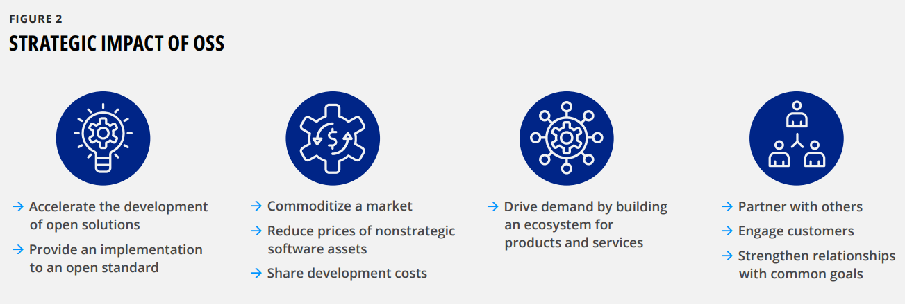

## Introduction

## 引言

 The availability of OSS is changing how organizations develop and deliver products. A transparent development community and access to public source code enable organizations to think differ- ently about procuring, implementing, testing, deploying, and main- taining software (**FIGURE 1**).
 
 开源软件（OSS）的可用性正在改变组织开发和交付产品的方式。透明的开发社区和对公共源代码的访问使组织能够以不同的方式思考采购、实施、测试、部署和维护软件（图1）。

 OSS has created an ecosystem with many benefits for all involved. Organizations across industries are building and growing their open source operations under an OSPO to help use and contribute to open source projects more efficiently and effectively and to benefit from its strategic impact (**FIGURE 2**).
 
 开源软件创建了一个生态系统，为所有参与者都带来许多好处。各行业的组织都 OSPO 的领导下在建立和发展其开源运营，以便更有效地使用和贡献开源项目，并从其战略影响中受益（图2）。

OSS allows shared development and lowers research and development costs by enabling organizations to reap the benefit of billions of dollars of OSS, which they can harness to create better products and services. In addition, it helps to accelerate product development and enables a faster time to market by aligning business needs with upstream open source projects. Organizations do not get involved in open source projects because it is fun; they do it because it is a part of their business or product strategy.

开源软件促进了共享开发，并通过使组织能够利用价值数十亿美元的开源成果，降低了研发成本，从而创造出更优质的产品和服务。此外，它还有助于加快产品开发速度，并通过与上游开源项目对齐商业需求，缩短上市时间。组织参与开源项目并非仅仅因为其趣味性；而是因为这是它们商业或产品战略的一部分。

 **FIGURE 1**

 **OPEN SOURCE IS A TECHNOLOGY MARKET ACCELERANT**

 **开源是技术市场的加速器**

- Neutral environment for collaboration & cross-pollination
- 中立的协作与交流环境
- Innovation multiplier community driven
- 创新倍增社区驱动
- Minimizes fragmentation and supports the upstream development model
- 最小化碎片化并支持上游开发模式
- Enables better interoperability
- 促进更好的互操作性
- Facilitates standardization on open technologies
- 促进开放技术的标准化
- Qualifies reference architectures
- 确立参考架构
- Lowers barriers to enter a new domain
- 降低进入新领域的门槛
- Enables business opportunities supportedby a flexible licensing model
- 通过灵活的许可模式开启商业机会
- Leads to better products, improved quality and security
- 带来更优质的产品、提升质量和安全性
- Allows fast trailing and shared cost of development
- 允许快速试错和共享开发成本

  

 **FIGURE 2**

**STRATEGIC IMPACT OF OSS**

**开源软件的战略影响**

- Accelerate the development of open solutions
- 加速开放解决方案的开发
- Provide an implementation to an open standard
- 为开放标准提供实施
- Commoditize a market
- 商品化市场
- Reduce prices of nonstrategic software assets
- 降低非战略性软件资产的价格
- Share development costs
- 共享开发成本
- Drive demand by building an ecosystem for products and services
- 通过为产品和服务构建生态系统来推动需求
- Partner with others
- 与他人合作
- Engage customers
- 吸引客户
- Strengthen relationships with common goals
- 加强具有共同目标的关系

 Where does most open source development happen? **GitHub**. GitHub is a crucial platform for open source development. It is a web-based hosting service that uses the Git version control system to allow developers to collaborate and share their code.

 大多数开源开发发生在哪里？**GitHub**。GitHub 是开源开发的关键平台。它是一个基于网络的托管服务，使用 Git 版本控制系统，允许开发者协作和共享他们的代码。

 It provides a centralized platform for open source developers to store, manage, and track changes to their codebase and collaborate on development efforts with other contributors.

 它为开源开发者提供了一个集中平台，用于存储、管理和跟踪代码库的变更，并与其他贡献者协作开发工作。

 One of the critical advantages of GitHub is that it allows developers to easily share their code with others, making it simple for others to contribute, review, and merge changes. It is a powerful tool for open source development, as it enables developers to work together on large-scale projects, regardless of their physical location. GitHub also provides a platform for community building and collaboration by allowing users to create open source projects, create and manage issues, and communicate with other developers via pull requests (PRs) and comments.

 GitHub的一个关键优势在于它允许开发者轻松地与他人共享代码，使得其他人能够简便地贡献、审查和合并更改。它是开源开发的一个强大工具，因为它使开发者能够无论身处何地都能在大规模项目上共同工作。GitHub还提供了一个社区建设和协作的平台，允许用户创建开源项目，创建和管理问题，并通过拉取请求（PRs）和评论与其他开发者沟通。

 Additionally, GitHub provides a wide range of tools and features tailored to open source developer's needs. It includes features such as project management tools, code review functionality, packaging, release, deployment capabilities, and built-in integration with other developer tools such as continuous integration services, making it an all-in-one platform for open source development.

 此外，GitHub提供了大量针对开源开发者需求定制的工具和特性。这些包括项目管理工具、代码审查功能、打包、发布、部署能力，以及与其他开发者工具（如持续集成服务）的内置集成，使其成为开源开发的全方位平台。

 This paper will discuss recommended practices to help you improve your GitHub presence to attract more users and developers to your projects.

 本文将讨论推荐实践，帮助您提升GitHub上的存在感，以吸引更多用户和开发者参与到您的项目中。
