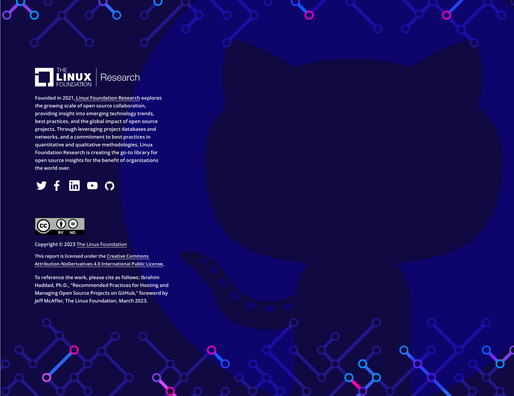

## Endnotes

 1 The TODO Group is an open community of practitioners hosted at the Linux Foundation whose goal is to create and share knowledge, collaborate on practices, tools, and other ways to run successful and effective open source initiatives and program offices.

## Acknowledgments

 The author would like to express his gratitude to Hilary Carter, Jason Perlow, Melissa Schmidt, and Barry Hall for their invaluable contri- butions to the development of this paper. Special thanks to Jeff McAffer for contributing the Foreword and for his insights and detailed feedback that has played a crucial role in improving this paper. Thank you all for your time and effort. The author also would like to acknowledge the contributions he received via LinkedIn from Sumanta Mukhopadhyay, Phil Coval, and Andreas Fehlner.

## Linux Foundation resources

- [E-book: A Road Map to Improve the Effectiveness and Impact of Enterprise Open Source Development](https://www.linuxfoundation.org/research/improving-enterprise-os-dev)

- [E-book: A Deep Dive into Open Source Program Offices](https://www.linuxfoundation.org/tools/a-deep-dive-into-open-source-program-offices/): Structure, Roles, Responsibilities, and Challenges

- [E-book: A Guide to Enterprise Open Source ](https://linuxfoundation.org/tools/guide-to-enterprise-open-source/)

- [E-book: Open Source Audits in Merger and Acquisition Transactions](https://www.linuxfoundation.org/resources/open-source-audits-merger-acquisition-transactions/)

- [Linux Foundation Enterprise Guides](https://www.linuxfoundation.org/resources/open-source-guides/)

- [Linux Foundation Open Source Compliance Program](https://compliance.linuxfoundation.org/)

- [TODO Group](http://todogroup.org/)

- [The Software Package Data Exchange](https://spdx.dev/)®

- [Linux Foundation Training & Certification](https://training.linuxfoundation.org/)
-
- [Linux Foundation Event](https://events.linuxfoundation.org/)s

## Feedback

 The author apologizes in advance for any spelling errors or possible errors and is grateful to [receive](https://www.ibrahimatlinux.com/collaboration/) corrections and suggestions for improvements.

## About the author

Dr. Ibrahim Haddad is the Executive Director of the Linux Foundation AI & Data and the PyTorch Foundation. His primary focus is facilitating a vendor-neutral environment for advancing the open source AI platform.

 Throughout his career, Haddad held technology and portfolio management roles at Ericsson Research, the Open Source Development Labs, Motorola, Palm, Hewlett-Packard, Samsung Research, and the Linux Foundation. Haddad graduated with honors from Concordia University (Montréal, Canada) with a Ph.D. in computer science.

 LinkedIn: [\@ibrahimhaddad](https://www.linkedin.com/in/ibrahimhaddad/) Twitter: [\@IbrahimAtLinux](https://twitter.com/ibrahimatlinux) Website: [IbrahimAtLinux.com[

 

 **Founded in 2021,** [ [ **[Linux Foundation Research [**](https://www.linuxfoundation.org/research/)**explores the growing scale of open source collaboration, providing insight into emerging technology trends, best practices, and the global impact of open source projects. Through leveraging project databases and networks, and a commitment to best practices in quantitative and qualitative methodologies, Linux Foundation Research is creating the go-to library for open source insights for the benefit of organizations the world over.**

 **Copyright © 2023** [The Linux Foundation](https://www.linuxfoundation.org/)

 **This report is licensed under the [Creative Commons](https://creativecommons.org/licenses/by-nd/4.0/) [Attribution-NoDerivatives 4.0 International Public License](https://creativecommons.org/licenses/by-nd/4.0/).**

 **To reference the work, please cite as follows: Ibrahim Haddad, Ph.D., "Recommended Practices for Hosting and Managing Open Source Projects on GitHub," foreword by Jeff McAffer, The Linux Foundation, March 2023.**